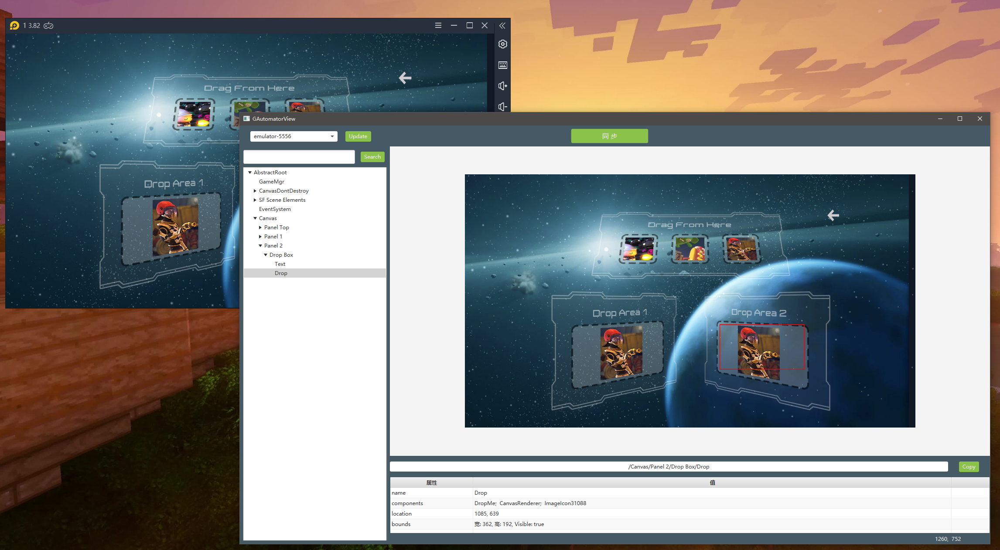

## GAutomatorView

GAutomator的辅助工具GAutomatorView的个人开发版本，基于javaFX，代码全部开源。它可以帮助你获取游戏中的控件信息。当前仅支持Unity游戏，而且使用工具的时候，游戏需要运行在一个Android设备或者模拟器上。腾讯推荐的GAView不仅不开源，而且有一些问题。比如在一台主机上连接着多台Android设备的时候，会出现连接错误的问题。这也是我打算自己写一个开源版本的原因。

使用的时候，先获取设备列表，然后再同步游戏状态。

为了方便测试，这个[仓库 - UnityDemo-TestGAutomatorView](https://github.com/qintianchen/UnityDemo-TestGAutomatorView)是一个现成的Unity项目，里面有一个已经构建好的[apk](https://github.com/qintianchen/UnityDemo-TestGAutomatorView/blob/master/Demo.apk)。你可以选择下载这个apk，安装到安卓设备上进行测试。如下图所示：

## Build Runnable Jar

这个版本基于java 8 + intellij idea开发。java 11以前的版本sdk里面都是自带javaFX的库，如果你用的是java 11（>=）的版本，需要自行去官网下载javaFX的库导入并按教程配置configuration。

生成可执行jar的方法如下：

1. File
2. Project Structure
3. Artifacts
4. \+
5. Jar
6. From modules with dependences 
7. 选择sample.Main主类，选择Extract to target Jar，Apply
8. Build
9. Build Artifacts

不过执行jar的方式还是有点不方便。工程生成exe可以用javafxpackager.exe，这个工具在jdk的目录下有。在某个版本之后，这个工具被统一进javapackager.exe了，用来统一java和javaFx的打包。具体的打包命令可以去网上参考。

## 后话

第一版是2020五一五天假期抽空写的。第一天用WPF写，最后竟然卡在了TreeView不知道如何遍历元素的问题上；

第二第三天经过调研，于是临时学了html,css,javascript，然后又学了vue.js，打算用electron+vue.js写一套，卡在了构建环境的问题上，不仅如此，javascript弱类型，原型链设计模式，ES6对模块化编程的支持让我很感到蛋疼。

最后两天终于像javaFX妥协，不过据说Oracle到2022年就不再对javaFX进行商业支持了。无论如何，学习javaFX只是为了解决燃眉之急，现在大型的软件开发几乎都是使用QT开发，而一些轻量级的软件则用类似electron这样的技术，毕竟html + css那套绘制一套漂亮的客户端太方便了。等有时间，会好好抽空学学前端技术，再用electron做一个版本。